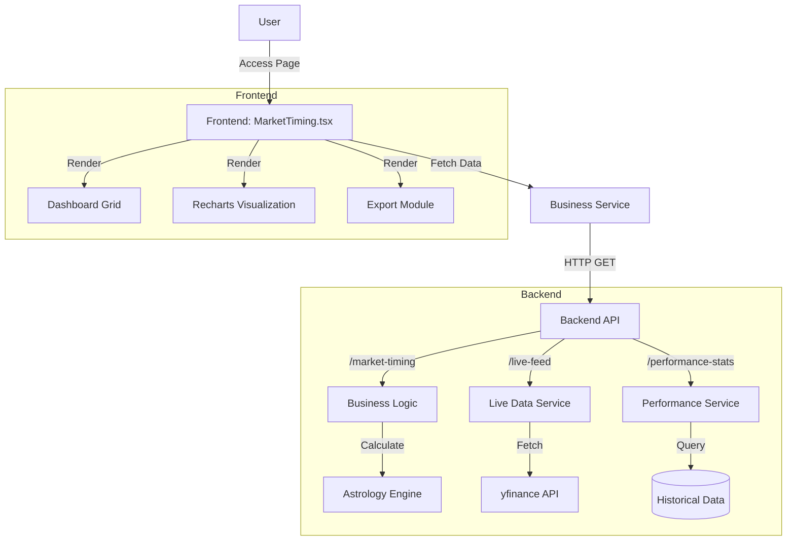

# Market Timing Intelligence - Technical Documentation

## 1. Overview
The **Market Timing Intelligence** module provides real-time market analysis by correlating planetary transits with financial market data. It offers actionable insights, risk assessments, and historical performance metrics to aid data-driven decision-making.

## 2. Architecture

### 2.1 High-Level Architecture
The system follows a layered architecture:
- **Presentation Layer (Frontend)**: React + TypeScript + Tailwind CSS
- **Service Layer (Frontend)**: Axios for API communication
- **API Layer (Backend)**: FastAPI
- **Business Logic Layer**: Planetary calculations, Market data fetching (yfinance), Sentiment analysis
- **Data Layer**: In-memory caching (for live feeds), SQLite/PostgreSQL (for user data - future scope)

### 2.2 Component Diagram (Mermaid)

### 2.3 Data Flow
1. **Initialization**: 
   - `MarketTiming` component mounts.
   - `useEffect` triggers parallel data fetching: `getMarketTiming`, `getLiveFeed`, `getPerformanceStats`.
2. **Real-time Updates**:
   - `setInterval` polls `getLiveFeed` every 30 seconds.
   - React state (`liveData`) updates, triggering re-render of Volatility Index and Market Mood.
3. **User Interaction**:
   - **Timeframe Toggle**: Updates `chartData` state (Daily/Weekly/Monthly).
   - **Export**: Generates a JSON blob from current state and triggers download.

## 3. Technology Stack
- **Frontend**:
  - React 18
  - TypeScript
  - Tailwind CSS (Styling)
  - Recharts (Data Visualization)
  - Lucide React (Icons)
- **Backend**:
  - FastAPI (Python)
  - Pydantic (Data Validation)
  - yfinance (Market Data)
  - ephem / pyswisseph (Planetary Calculations - implied)

## 4. API Specification

### 4.1 GET /business/market-timing
Returns planetary transit data and generated market insights.
- **Response**: `MarketTimingResponse`
  - `date`: ISO string
  - `transits`: Array of planetary positions
  - `insights`: Array of risk/opportunity signals
  - `summary`: Textual market overview

### 4.2 GET /business/live-feed
Returns real-time market metrics.
- **Response**: `LiveFeedResponse`
  - `market_mood`: "Bullish" | "Bearish" | "Neutral"
  - `volatility_index`: 0-100 score

### 4.3 GET /business/performance-stats
Returns historical accuracy of the astrological model.
- **Response**: `PerformanceStatsResponse`
  - `metrics`: Win rate, total signals, profit factor

## 5. Security & Performance
- **Security**: 
  - Input validation via Pydantic.
  - CORS configured for frontend origin.
- **Performance**:
  - Parallel data fetching reduces initial load time.
  - Live data polling is optimized to 30s intervals to avoid rate limits.
  - UI components use `memo` (implicit via React compiler or manual optimization if needed) to prevent unnecessary re-renders.

## 6. Accessibility (A11y)
- **Colors**: High contrast colors used for text and charts.
- **Screen Readers**: Semantic HTML structure (`main`, `h1`-`h3`, `table`).
- **Keyboard Navigation**: Interactive elements (buttons, toggles) are focusable.
